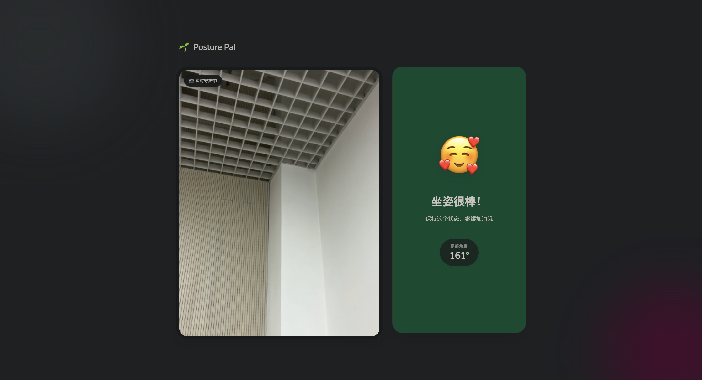
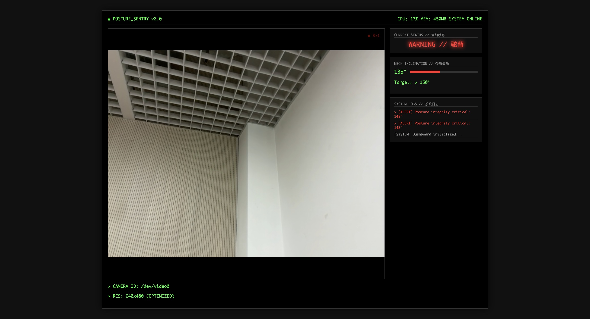

# 🌱 Posture Sentry (坐姿守护者)

> 一个基于 MediaPipe 和 Flask 的智能视觉坐姿矫正系统。
> A Real-time Posture Correction Assistant powered by Computer Vision.


## 📖 项目介绍 (Introduction)

**Posture Sentry** 是南开大学 Python 综合课程设计项目。针对长期久坐的程序员和学生群体，我们开发了这款非接触式的坐姿监测 Web 应用。

它利用 **Google MediaPipe** 实时捕捉人体关键点，计算颈部倾斜角度。与传统枯燥的检测工具不同，本项目创新性地提供了**双重沉浸式交互模式**，让保持健康坐姿变得更加有趣。

### ✨ 核心特性 (Key Features)

* **⚡ 实时监测**：调用本地摄像头，低延迟分析坐姿状态。
* **🎭 双重人格 UI**：
    * **🥰 治愈模式 (Cute Mode)**：柔和的配色与 Emoji 互动，提供温暖的情绪价值。
    * **💻 黑客模式 (Hacker Mode)**：高对比度终端风格，模拟《黑客帝国》视觉体验。
* **🧠 智能算法**：
    * **向量角度计算**：基于耳垂与肩部关键点计算颈部倾角。
    * **迟滞阈值 (Hysteresis)**：引入 `149°/151°` 状态缓冲区，防止临界状态下的误报和闪烁。
* **🌊 流畅体验**：采用 MJPEG 视频流传输技术与 AJAX 异步状态轮询。

---

## 📸 演示 (Demo)


| 治愈模式 (Cute Mode) | 黑客模式 (Hacker Mode) |
| :---: | :---: |
|  |  |

---

## 🛠️ 技术栈 (Tech Stack)

* **后端 (Backend)**: Python, Flask
* **计算机视觉 (CV)**: OpenCV, MediaPipe Pose
* **前端 (Frontend)**: HTML5, CSS3, JavaScript (Fetch API)
* **数据处理**: NumPy

---

## 🚀 快速开始 (Quick Start)

### 1. 克隆仓库与环境配置
```bash
git clone [https://github.com/masterZIF/Posture_Sentry.git](https://github.com/masterZIF/Posture_Sentry.git)
cd Posture_Sentry

# 创建虚拟环境
python -m venv venv

# 激活环境 (Mac/Linux)
source venv/bin/activate
# 激活环境 (Windows)
venv\Scripts\activate
````

### 2\. 安装依赖并运行

```bash
# 安装依赖包
pip install -r requirements.txt

# 启动应用
python app.py
```

运行成功后，浏览器将自动打开 `http://127.0.0.1:5001/`。

-----

## 📂 项目结构 (Project Structure)

```text
Posture-Sentry/
├── app.py                # Flask 应用入口与路由控制
├── camera.py             # 核心视觉类：封装 MediaPipe 与姿态计算逻辑
├── requirements.txt      # 项目依赖列表
├── static/               # 静态资源
│   ├── css/
│   │   ├── cute.css      # 治愈模式样式
│   │   └── hacker.css    # 黑客模式样式
│   └── js/
│       ├── cute.js       # 治愈模式前端逻辑
│       └── hacker.js     # 黑客模式前端逻辑
└── templates/            # HTML 模板
    ├── menu.html         # 启动菜单
    ├── cute.html         # 治愈模式页面
    └── hacker.html       # 黑客模式页面
```

-----

## 📐 算法原理 (Algorithm)

本项目通过 `camera.py` 中的 `VideoCamera` 类实现核心检测逻辑：

1.  **关键点提取**：使用 MediaPipe Pose 模型提取左耳 (Landmark 7) 和左肩 (Landmark 11) 的坐标。
2.  **向量构建**：构建“耳-肩”向量与“肩-垂直向下”参考向量。
3.  **角度计算**：
    $$ \text{Angle} = \arctan2(dy, dx) $$
    计算两向量夹角，以此量化颈部前倾程度。
4.  **状态机与平滑**：
      * 使用 `deque(maxlen=5)` 进行移动平均滤波，减少视频流抖动造成的数值跳变。
      * 设定迟滞比较器：当角度 `< 149°` 触发警告，仅当角度恢复至 `> 151°` 时才解除警告。

-----

## 👥 团队成员 (Team)

  * **成员 1**: [姓名/学号] - 负责后端架构与算法实现
  * **成员 2**: [姓名/学号] - 负责前端 UI 设计与交互逻辑
  * **成员 3**: [姓名/学号] - 负责测试与文档编写

-----

## 📝 声明

本项目为 Python 综合课程设计作业。代码主要由团队原创开发，部分视觉参考开源社区灵感。

```
```
